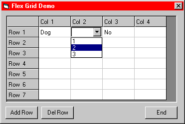



## MS FlexGrid with Combo box and more\.\.\.

### Description

Ever wanted to have drop down combo boxes, list boxes, or check boxes in a MS FlexGrid? Well with this code you can now do it. With the code you can see how to do it for your own projects. You can add or take out what you need for your program. All you ned to to then is write the code to load the FlexGrid and save the changes to the grid. I also included two buttons that can add or delete grid rows on the fly.
 
### More Info
 
User needs know how to work with FlexGrids and Combo boxes.

             |
---                |---
**Submitted On**   |2000-08-04 08:22:18
**By**             |[N/A](https://github.com/Planet-Source-Code/PSCIndex/blob/master/ByAuthor/empty.md)
**Level**          |Intermediate
**User Rating**    |4.8 (86 globes from 18 users)
**Compatibility**  |VB 5\.0, VB 6\.0
**Category**       |[Miscellaneous](https://github.com/Planet-Source-Code/PSCIndex/blob/master/ByCategory/miscellaneous__1-1.md)
**World**          |[Visual Basic](https://github.com/Planet-Source-Code/PSCIndex/blob/master/ByWorld/visual-basic.md)
**Archive File**   |[CODE\_UPLOAD8602842000\.zip](https://github.com/Planet-Source-Code/ms-flexgrid-with-combo-box-and-more__1-10392/archive/master.zip)

